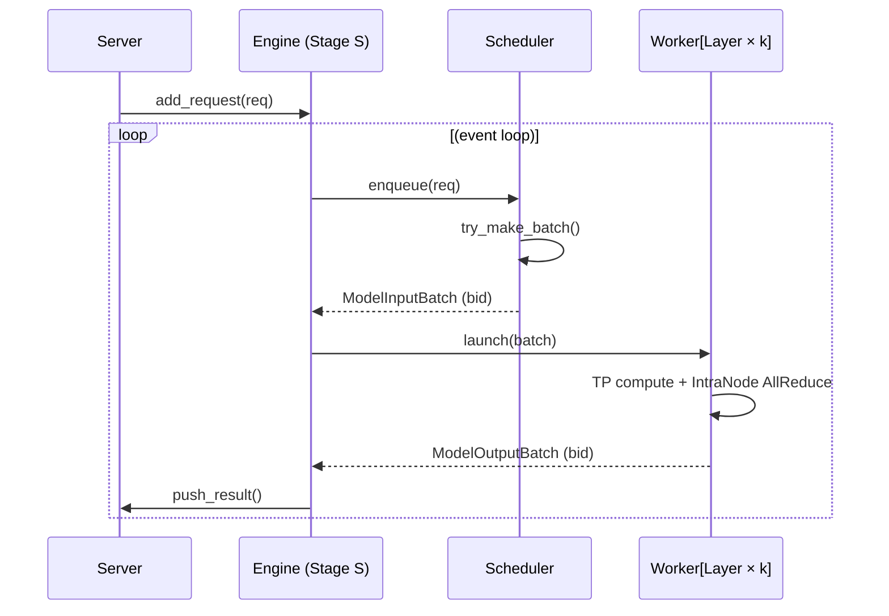
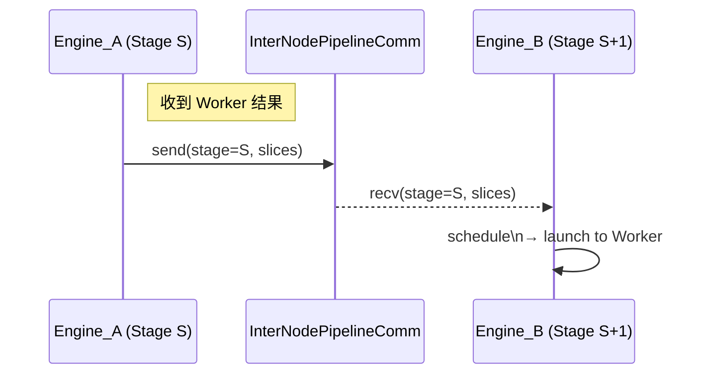
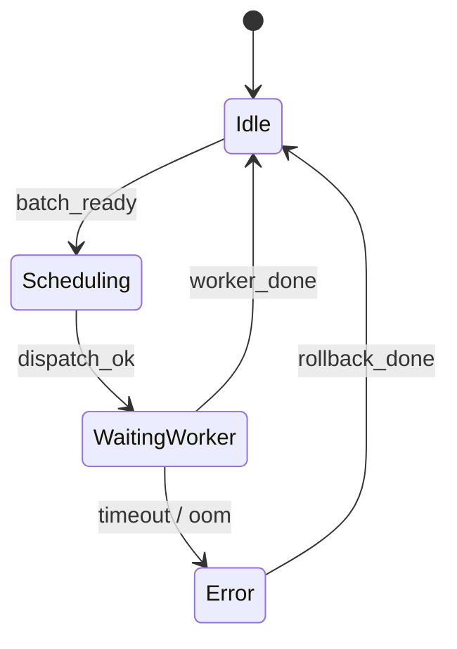

# LABInfer
<p align="center">
  
</p>

[roadmap](https://github.com/users/Zhuwenbopro/projects/1)

&nbsp;&nbsp;&nbsp;&nbsp;&nbsp;&nbsp;&nbsp;&nbsp;目标是创建异构、分布式大语言模型推理框架。尽量使用最直白的实现方式实现各个模块，并提供设计实现思路，方便各位实验室的同学在此基础上修改代码，融入自己的 idea。

```
# 安装 OpenBLAS
sudo apt-get install libopenblas-dev

sudo apt-get install libopencv-dev
```
# 任务描述（Prompt）

我在设计大语言模型的推理引擎，C++ 实现，支持多节点多卡并行计算，节点内 TP + PP，节点间只 PP。

* Server 使用 engine.add_request() 添加请求，随即 Engine 内部进行运算，每一轮的 step 存到某个队列内，由 Server 自行取用。
* Engine 利用 Scheduler 将 request 组成 request_batch 送给 Worker。（Scheduler 负责决策，Engine 负责根据决策准备 ModelInputBatch（包含 tokens, Block Tables 等）并分发给 Worker(s)。）
* Worker 利用 Communicator 和 Layer 进行节点内的 TP 计算（Worker 执行其拥有的 Layer，而这些 Layer 如果是张量并行的，会使用注入的 IntraNodeTensorParallelCommunicator 来进行 TP 组内部的通信（如 AllReduce, AllGather）。）
* Worker 完成其节点内的 TP 计算后，将其（作为流水线一个阶段的）输出结果报告/返回给其所在节点的 Engine
* 不同节点上的 Engine 实例之间。一个节点的 Engine (我们称之为 Engine_A，负责阶段 S) 在收到其内部 Worker 的结果后，会使用 InterNodePipelineCommunicator 将这个结果 Send 给负责下一个阶段 S+1 的另一个节点上的 Engine (我们称之为 Engine_B)。同样，Engine_B 会使用这个 Communicator 来 Recv 来自 Engine_A 的数据。

# 接口定义
```
// common.h ----------------------------------------
using RequestId   = uint64_t;
using BatchId     = uint64_t;
using StageId     = uint32_t;   // PP stage idx
using TPGroupId   = uint32_t;

enum class Precision   { FP16, BF16, INT8 };
enum class DeviceType  { GPU, NPU, CPU  };
enum class EngineErr   { OK, TIMEOUT, OOM, INTERNAL };
// INTERNAL: 内部错误，表示引擎内部发生了一些未预料到的问题。

// -------- Model inputs / outputs ---------------
// 
struct TokenBlockTable {
    std::vector<int32_t> tokens;   // flat - row-major  所有序列的token被连续存储
    std::vector<int32_t> row_ptr;  // CSR-style
};
// 输入给模型的一个批次数据
struct ModelInputBatch {
    BatchId        bid;
    std::vector<RequestId> req_ids;
    TokenBlockTable tbl;
};
// 模型对一个输入批次产生的输出。
struct ModelOutputBatch {
    BatchId        bid;
    std::vector<RequestId> req_ids;
    std::vector<float> logits;     // flattened [B, V]
};

// -------- TP / PP payload ----------------------
// 张量的切片
struct TensorSlices {
    BatchId  bid;
    StageId  stage;
    /* contiguous slices in column-parallel layout */
    std::vector<float> data;
};

// -----------------------------------------------

```
## 接口表

| 组件               | 主要职责                                                                    | 关键方法（同步/异步）                                                                                                                                                       | 说明                                     |
| ---------------- | ----------------------------------------------------------------------- | ----------------------------------------------------------------------------------------------------------------------------------------------------------------- | -------------------------------------- |
| **Engine**       | 全局协调；PP stage 控制；结果队列                                                   | `add_request(const Request&)` 异步<br>`poll_result(EngineResult&) -> bool` 非阻塞<br>`on_worker_done(const ModelOutputBatch&)`<br>`on_stage_recv(const TensorSlices&)` | 封装 FSM/Actor；内部线程安全                    |
| **Scheduler**    | 批处理策略（prefill + decode 拆分、KV 预算、padding 控制）                             | `schedule(const Request&) -> void`<br>`try_make_batch() -> std::optional<ModelInputBatch>`                                                                        | 仅暴露给同节点 Engine                         |
| **Worker**       | 负责一个或多层；节点内 TP                                                          | `launch(const ModelInputBatch&)` 异步<br>`progress() -> WorkerStatus` 轮询<br>`stop()`                                                                                | Worker 内部持有 `IntraNodeTPCommunicator*` |
| **Communicator** | **Intra-Node TP**：AllReduce/AllGather<br>**Inter-Node PP**：Send/Recv 激活 | `all_reduce(TensorSlices&)`<br>`all_gather(TensorSlices&)`<br>`send(StageId, const TensorSlices&)`<br>`recv(StageId, TensorSlices&)`                              | 为方便测试，可提供 Mock                         |


## 时序图
### 单节点内部：Server → Engine → Scheduler → Worker

### 跨节点流水线：Stage S → Stage S+1

### Engine / Worker 状态机（简版）


##  Back-pressure & 异常流约定
| 场景                         | 触发方          | 处理策略                                                                                                            |
| -------------------------- | ------------ | --------------------------------------------------------------------------------------------------------------- |
| **Engine → Scheduler 队列满** | Scheduler    | `schedule()` 返回 `false`，Engine 将请求放入“溢出 list”并通过 `Server.reply_queue_full(req_id)` 反馈客户端可重试或等待                  |
| **Worker OOM / GPU Reset** | Worker       | 1. 触发 `WorkerError{OOM, id}` 事件<br>2. Engine 标记该 batch 失败，写入统一 `ErrorQueue`<br>3. Supervisor 可选择重启 Worker 或降级精度 |
| **Inter-Node Send 超时**     | Communicator | Engine 进入 `Error` 状态 → 上报监控 → 自动重连或切换备用链路                                                                       |

# 详细设计
## Communicator
## KVCacheManager
## Scheduler
* Scheduler 层可以基于 Token-level Cost/资源消耗动态调整 batch，大幅提升 decode 阶段利用率。

# 接下来的方向
1. 具体的 Communicator 实现细节:
  * 如何基于 NCCL 或 MPI 实现 IntraNodeTensorParallelCommunicator 和 InterNodePipelineCommunicator？
  * 通信组 (Communicator Groups) 的创建和管理。
  * 异步通信操作与 CUDA Stream 的结合。
  * 错误处理和容错。
2. KVCacheManager 和 PagedAttention 的具体实现:
  * 物理块的分配/释放策略 (e.g., best-fit, first-fit)。
  * Block Table 的数据结构和在 GPU 上的管理。
  * 如何处理 KV Cache 的 swapping (换入换出 GPU/CPU)。
  * 与 Scheduler 的交互接口。
3. Scheduler 的具体调度策略实现:
  * FCFS (First-Come, First-Served) 的简单实现。
  * 更高级的策略如连续批处理 (Continuous Batching) 的核心逻辑，如何优先处理 prefill，如何平衡吞吐量和延迟。
  * 如何考虑 KV Cache 占用作为调度决策的一部分。
  * 动态批处理大小的调整。
4. Engine 的流水线调度逻辑 (Pipelining Scheduler):
  * 微批次 (micro-batch) 的切分和管理。
  * 不同流水线调度算法 (如 GPipe, PipeDream, 1F1B/Interleaved) 的实现细节和状态机。
  * 如何管理流水线中的“气泡” (bubbles) 以提高效率。
  * 前向传播和反向传播（如果考虑训练或微调）在流水线中的协调。
5. Worker 的内部实现:
  * 如何加载和管理模型分片 (shards of layers)。
  * 任务队列和内部线程池的设计。
  * CUDA Stream 和 Event 的使用，以实现计算和通信的重叠。
  * 错误处理和向 Engine 报告状态。
6. 数据结构和序列化/反序列化:
  * ModelInputBatch, ModelOutputBatch, SequenceEvent 等核心数据结构的具体字段和设计。
  * 在跨节点 PP 通信时，张量 (Tensor) 和其他元数据如何进行高效的序列化和反序列化。
7. 性能优化技巧:
  * 算子融合 (Operator Fusion)。
  * 量化 (Quantization)。
  * FlashAttention 等高效 Attention 实现的集成。
  * 减少数据拷贝和同步开销。
8. 容错和弹性:
  * 如何处理节点故障或 Worker 故障？
  * 请求重试机制。
  * 状态的持久化和恢复（如果需要）。
9. 配置和部署:
  * 系统如何通过配置文件来定义分布式拓扑（节点数、GPU数、TP/PP 维度等）？
  * 部署到 Kubernetes 或其他集群管理系统。


1. 先从 Worker 层试点 FSM + Actor：
  * 把 Worker 改写成单线程 Actor；Engine 暂保持旧实现，先观测稳定性收益。
  * 用 CAF 或自研轻量框架都行，关键是 显式列状态 + 明确转移。
2. 逐步引入动态属性：
  * 先只把 precision 做成可热切换（FP16 ↔ INT8），验证 KernelRegistry 路径。
  * 再扩展到 quant_scheme、kv_cache_layout 等更细粒度属性。
3. 监控与回滚：
  * FSM/Actor 转入 Error 时，用监控上报 + 自动降级（e.g. fallback FP16）机制，而不是直接崩溃服务。