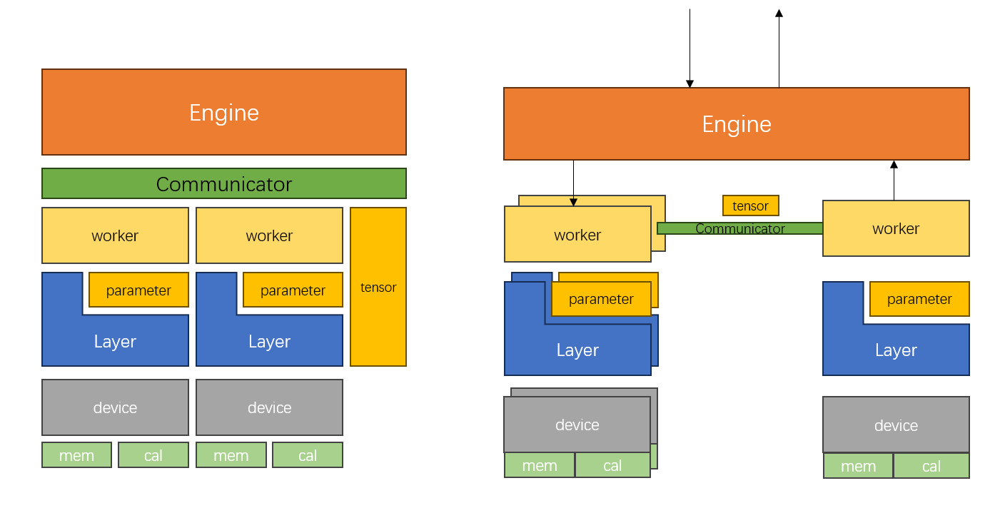

# LABInfer
<p align="center">
  
</p>
&nbsp;&nbsp;&nbsp;&nbsp;&nbsp;&nbsp;&nbsp;&nbsp;目标是创建异构、分布式大语言模型推理框架。尽量使用最直白的实现方式实现各个模块，并提供设计实现思路，方便各位实验室的同学在此基础上修改代码，融入自己的 idea。

**TODO List**
#### 第一阶段 v0.1
分词器 tokenizer : encode、decode 暂时先用 [huggingface](https://github.com/huggingface/tokenizers) 的吧，之后再说
- [ ] 各种 transformer 层 layers
- [ ] state load -- [safetensor]([https://github.com/syoyo/safetensors-cpp)
- [ ] 每层采样计算时间，用于后续评估
- [ ] 手工搭一个[模型测试推理](https://huggingface.co/meta-llama/Llama-3.2-1B/tree/main?library=transformers)
- [ ] 支持 kv cache
- [x] 支持 batch

```
/test/layer_test 内的 测试程序 main.cc 需要下面的数据，放到文件下
链接：https://pan.baidu.com/s/1NaCiVebIFhUJZ60hkm851g?pwd=b72y 
提取码：b72y 
```

#### 第二阶段
- [ ] swap
- [ ] pipeline
- [ ] pagedAttention
- [ ] chunk
- [ ] 根据采样时间划分模型
- [ ] temperature
- [ ] top-k

#### 第三阶段
- [ ] 精细管理 gpu
- [ ] 构建上层服务框架
- [ ] 实现集成式的 tokenizer
- [ ] 优化 RoPE

**detail**
- [ ] 使用智能指针解决variable和layer内存问题，防止内存泄漏

## 设计
* **设计目标**：异构的、可调度的、支持分布式的推理服务程序。

<p align="center">
  
</p>

&nbsp;&nbsp;&nbsp;&nbsp;&nbsp;&nbsp;&nbsp;&nbsp;整体架构如上图所示，项目分为三个阶段完成。首先完成设备抽象层的实现，到此层有抽象的接口去使用底层不同硬件；然后实现管理层代码（中间两部分），实现后可以在单机多卡上跑通大语言模型，调度使用卡在内存和算力上的使用率；最后一个阶段是实现分布式的推理，完成后可以一键提供大语言模型的推理服务。

### Device 层
&nbsp;&nbsp;&nbsp;&nbsp;&nbsp;&nbsp;&nbsp;&nbsp;Device 类拥有四项内存相关的功能：1）分配内存；2）回收内存；3）把数据移入设备；4）把数据移出设备。其中前两项主要是依靠 allocator 完成。除了内存相关的函数外，与计算相关的函数通过调用 F 使用，使用方法为 `dev.F.calculate()` 。
```
Device
    // 从 CPU 内存中取数据
    void move_in(float* ptr_dev, float* ptr_cpu, size_t bytes);
    // 移除数据到 CPU
    void move_out(float* ptr_dev, float* ptr_cpu, size_t bytes);
    // 分配内存
    void allocate(float* ptr, size_t size);
    // 回收内存
    void deallocate(float* ptr);

    Function* F;
    Allocator* allocator;
```

#### Allocator
&nbsp;&nbsp;&nbsp;&nbsp;&nbsp;&nbsp;&nbsp;&nbsp;Allocator 类目前就负责两个责任：1）分配设备内存，2）回收设备内存。更高级、复杂的机制我们在后面再慢慢往里加。
```
Allocator
    void allocate(void* ptr, std::size_t size);
    void deallocate(void* ptr);
```
#### Function
&nbsp;&nbsp;&nbsp;&nbsp;&nbsp;&nbsp;&nbsp;&nbsp;函数部分负责提供计算，目前默认是使用100%的算力，没有提供算力使用率的选项，未来manager在进行分配时应当把算力使用率考虑在内。

### Manager 层
&nbsp;&nbsp;&nbsp;&nbsp;&nbsp;&nbsp;&nbsp;&nbsp;manager 层负责调度加速器，包括：算力和内存两部分，对于cuda来讲，算力就是分配给上层 layer 的 SM 芯片数，内存就是显存。理论上来讲 manager 层可以把当前加速器的内存同一收集起来自己做调度，这样会有很大的优化空间。目前，我们仅仅是向上传递 allocator 的方法，先实现，再优化。

#### 变量（variable）与模型（model）的关系
变量类 Variable 有两个子类：Tensor、Parameter，分别代表隐藏层之间传递的参数和模型自身的权重。变量应该仅为模型使用，整个模型的内存也都由变量占据。变量的内存应该由模型借助 allocator 去分配。这样在进行模型内部改造时会比较灵活。*为了节省内存，可以让一块GPU内的所有隐藏层结果放到同一块显存中。*
#### 模型类的设计
由于本框架只面向推理，模型的结构一早就构建好了。使用者不应该关系模型如何构建，设计理想是根据一张模型的图纸（*model.map*），在服务启动时就会自动地构建好模型，加载好参数，准备开始服务。用户在使用模型时，只需要提供模型参数和模型图纸即可。

#### 变量类的设计
对于变量内部的device，总共就那么几种，不需要每个变量都开辟新的空间，可以用某个设计模式解决这个问题。

#### 如何实现异构
异构，即同一套代码可以使用不同的加速器，在本框架下主要体现在两个部分 —— allocator、function，分别提供数据的存储和运算。


## 学习笔记
#### 如何读取权重？（权重文件的格式）
对于 huggingface 的 xxx.safetensor，详细的介绍请看[这里](https://zhuanlan.zhihu.com/p/686570419)
#### 矩阵在 cuda 里是怎么表示的？（cuda里都是一位的数组，是怎么分割成矩阵，并进行运算的）

