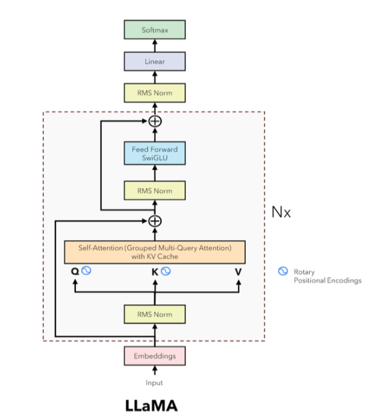
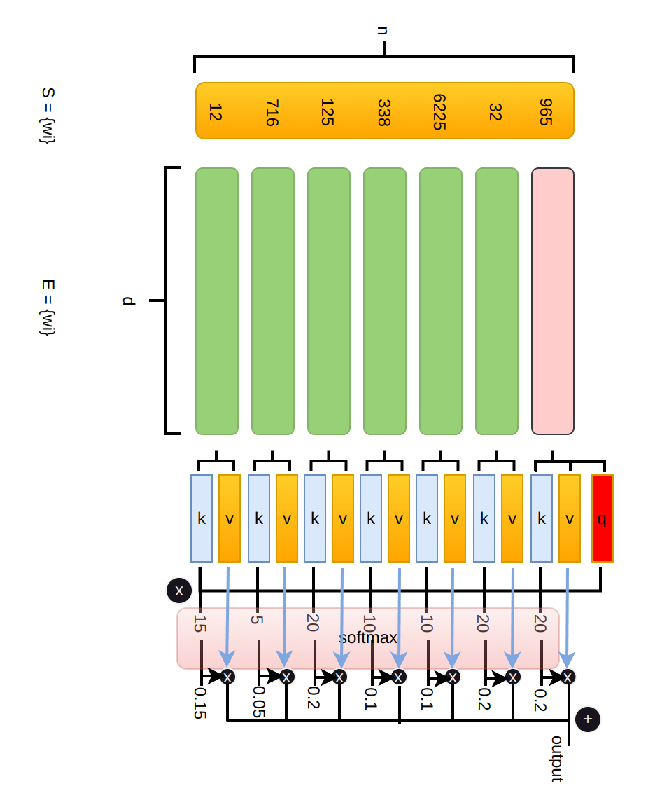

# Llama 3-8B
```
self.model LlamaModel(
  (embed_tokens): Embedding(128256, 4096)
  (layers): ModuleList(
    (0-31): 32 x LlamaDecoderLayer(
      (self_attn): LlamaSdpaAttention(
        (q_proj): Linear(in_features=4096, out_features=4096, bias=False)
        (k_proj): Linear(in_features=4096, out_features=1024, bias=False)
        (v_proj): Linear(in_features=4096, out_features=1024, bias=False)
        (o_proj): Linear(in_features=4096, out_features=4096, bias=False)
        (rotary_emb): LlamaRotaryEmbedding()
      )
      (mlp): LlamaMLP(
        (gate_proj): Linear(in_features=4096, out_features=14336, bias=False)
        (up_proj): Linear(in_features=4096, out_features=14336, bias=False)
        (down_proj): Linear(in_features=14336, out_features=4096, bias=False)
        (act_fn): SiLU()
      )
      (input_layernorm): LlamaRMSNorm((4096,), eps=1e-05)
      (post_attention_layernorm): LlamaRMSNorm((4096,), eps=1e-05)
    )
  )
  (norm): LlamaRMSNorm((4096,), eps=1e-05)
  (rotary_emb): LlamaRotaryEmbedding()
)
```
<p align="center">
  
</p>

接下来让我们一层一层研究 llama 是如何运作的。我们假设当前已经存在 n 个token,我们要预测第 n+1 个token。第 n 个 token 经过 Embedding 层变成向量后，开始进入 attention 层。开始前我们统一一下符号，$S_n=\{w_i\}^n_{i=1}$ 是我们的输入序列，就是下图黄色里的数；$E_n=\{x_i\}^n_{i=1}$ 是序列通过 embedding 层得到的向量序列，也就是下图的中间那段，向量 $x_i$ 的长度为 $d$ 。下面我们先从 attention 的 Q、K、V 说起。
<p align="center">
  
</p>

## Attention

Query、Key、Value 是注意力机制的精华所在，每一个 transformer 层的输入（$input$，第一层的input就来自于上次得到的词向量）经过该层的三个矩阵（$W_q、W_k、W_v$）得到三个向量（$q、k、v$）。我们认为不同位置的词（它们的 value）对于接下来的预测的词贡献不同。这个贡献的程度从数学的角度来讲就是权重——经过 softmax 算出的权重。softmax 的输入是什么呢？我们用当前的词生成 query（代表我要预测的向量查询）来点乘不同位置的 key（$q \cdot k$）来表示当前位置的 value 对于我要预测词的重要程度。

总结一下，第 n 个词的词向量会生产出一个 query 向量，与每个位置的 key 做点乘会得到该位置对于预测下一个词的重要性。对点乘的值向量做 softmax 得到每个位置 value 对下一个词预测的作用权重。用 softmax 得到的比例乘上自己的 value，再相加得到对每个位置加权后的预测向量。

## Rotary Positional Embedding(RoPE)
好啦，我们现在仔细看一眼 llama 的结构图，我们会发现在 Q、K 旁边会有个太极的标记。在图的右侧对太极图标的标注是“Rotary Positional Embedding”。关于位置编码，[这篇文章](https://zhuanlan.zhihu.com/p/642884818)讲得挺好，看他第一个评论让人茅厕顿开。我简单总结一下。

如果只是 $q_n = W_q \cdot x_n、k_i = W_k \cdot x_i$ 这样并没有考虑 $x_i$ 所在的位置信息 $i$ 。我们希望有一个函数，让从 $x_i$ 变为 $q_i、k_i$ 时考虑到位置信息 $i$ ，如下面公式所示。

$$\begin{aligned} q_n &= f_q(x_n, n)\\k_i &= f_k(x_i, i)\\v_i &= f_v(x_i, i) \end{aligned}$$

经过计算出 $q_n、k_i、v_i$ 就会进行我在上节 Attention 部分讲述的过程，用数学公式表示如下：

$$\begin{aligned} \alpha_{n,i} &= \frac{exp(\frac{q^T_nk_i}{\sqrt{d}})}{\sum^n_{j=1}exp(\frac{q^T_nk_j}{\sqrt{d}})}\\o_n&=\sum^n_{i=1}\alpha_{n,i}v_i \end{aligned}$$

最开始用的是绝对位置编码，但是科学家们又考虑找个函数将相对位置也表示进去。我们看上面第一个式子分母上面的 $q^T_nk_i$ ，也就是 $f_q(x_n, n)^Tf_k(x_i, i)$。要考虑到相对位置的话，我们希望这个函数 $f$ 满足 $f_q(x_n, n)^Tf_k(x_i, i) = g(x_n, x_i, n-i)$。然后科学家们就找到了旋转矩阵 $R_{\theta}$ 。旋转矩阵满足以下两个性质：

$$
\begin{align}R_{\alpha}^T &= R_{-\alpha}\\ R_{\alpha}R_{\beta} &= R_{\alpha+\beta}\end{align}
$$

我们下面来把这个性质套到上面我们希望找到的函数里：

$$
\begin{aligned}&f_q(x_n, n)^Tf_k(x_i, i) \\=\ &(R_nW_qx_n)^T(R_iW_kx_i)\\=\ &x_n^TW_q^TR_n^TR_iW_kx_i\\=\ &x_n^TW_q^TR_{i-n}W_kx_i\\=\ &g(x_n, x_i, n-i)\end{aligned}
$$

我一个搞推理的，其实知道怎么算就得了，不需要搞什么证明。详细的过程可以看[这篇文章](https://www.kexue.fm/archives/8265)。我们来看代码实现：
```
def precompute_freqs_cis(dim: int, seq_len: int, theta: float = 10000.0):
    # 计算词向量元素两两分组之后，每组元素对应的旋转角度
    freqs = 1.0 / (theta ** (torch.arange(0, dim, 2)[: (dim // 2)].float() / dim))
    # 生成 token 序列索引 t = [0, 1,..., seq_len-1]
    t = torch.arange(seq_len, device=freqs.device)
    # freqs.shape = [seq_len, dim // 2] 
    freqs = torch.outer(t, freqs).float()
    # torch.polar 的文档
    # https://pytorch.org/docs/stable/generated/torch.polar.html
    # 计算结果是个复数向量
    # 假设 freqs = [x, y]
    # 则 freqs_cis = [cos(x) + sin(x)i, cos(y) + sin(y)i]
    freqs_cis = torch.polar(torch.ones_like(freqs), freqs)
    return freqs_cis

def apply_rotary_emb(
    xq: torch.Tensor,
    xk: torch.Tensor,
    freqs_cis: torch.Tensor,
) -> Tuple[torch.Tensor, torch.Tensor]:
    # xq.shape = [batch_size, seq_len, dim]
    # xq_.shape = [batch_size, seq_len, dim // 2, 2]
    xq_ = xq.float().reshape(*xq.shape[:-1], -1, 2)
    xk_ = xk.float().reshape(*xk.shape[:-1], -1, 2)
    
    # 转为复数域
    xq_ = torch.view_as_complex(xq_)
    xk_ = torch.view_as_complex(xk_)
    
    # 应用旋转操作，然后将结果转回实数域
    # xq_out.shape = [batch_size, seq_len, dim]
    xq_out = torch.view_as_real(xq_ * freqs_cis).flatten(2)
    xk_out = torch.view_as_real(xk_ * freqs_cis).flatten(2)
    return xq_out.type_as(xq), xk_out.type_as(xk)

class Attention(nn.Module):
    def __init__(self, args: ModelArgs):
        super().__init__()

        self.wq = Linear(...)
        self.wk = Linear(...)
        self.wv = Linear(...)
        
        self.freqs_cis = precompute_freqs_cis(dim, max_seq_len * 2)

    def forward(self, x: torch.Tensor):
        bsz, seqlen, _ = x.shape
        xq, xk, xv = self.wq(x), self.wk(x), self.wv(x)

        xq = xq.view(batch_size, seq_len, dim)
        xk = xk.view(batch_size, seq_len, dim)
        xv = xv.view(batch_size, seq_len, dim)

        # attention 操作之前，应用旋转位置编码
        xq, xk = apply_rotary_emb(xq, xk, freqs_cis=freqs_cis)
        
        # scores.shape = (bs, seqlen, seqlen)
        scores = torch.matmul(xq, xk.transpose(1, 2)) / math.sqrt(dim)
        scores = F.softmax(scores.float(), dim=-1)
        output = torch.matmul(scores, xv)  # (batch_size, seq_len, dim)
```